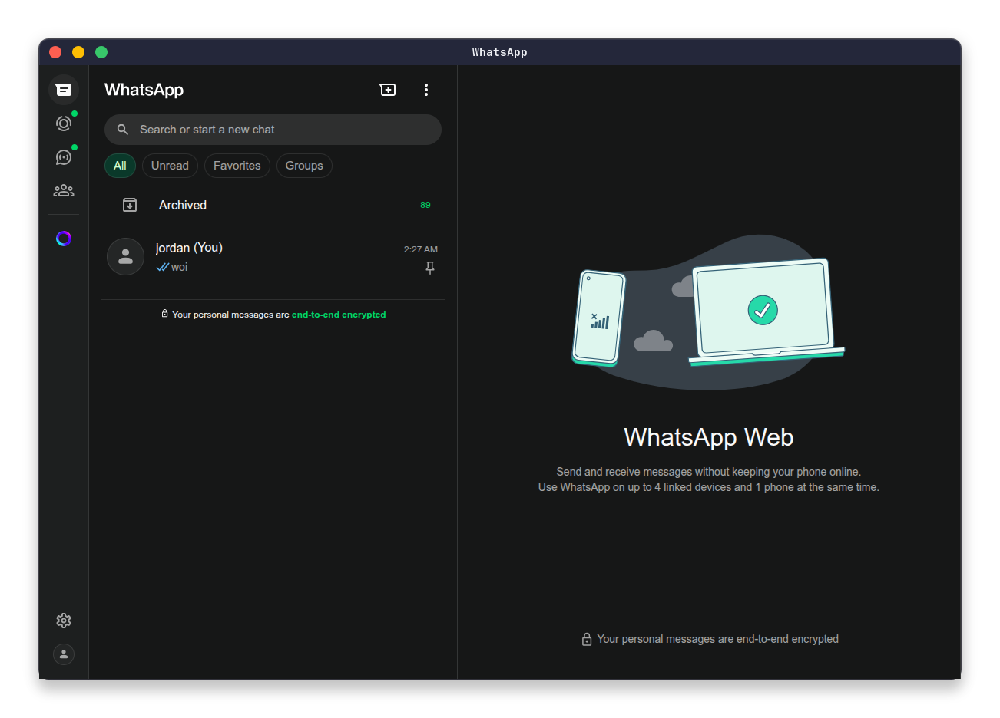

<div align="center">

</div>

# wunix - WhatsApp client for Linux
wunix (Whatsapp UNIX) is an unofficial WhatsApp client for Linux. Aim to serve WhatsApp applications to Linux user.

[](https://choosealicense.com/licenses/mit/)


## Demo
<div align="center">

</div>
## Screenshots





## Features

- Clean and beautiful-looking UI
- Easy to install and use
- Uses Electron as its main base
- Open-source and customizable


## Build

To build this project:

Build Project
```bash
  chmod +x ./build.sh
  ./build.sh
```

## Install
Installing and using wunix

Install Wunix
```bash
  sudo dpkg -i wunix_1.0.0_amd64.deb
```

## FAQ

#### Is 'wunix' safe to use?

Yes, it is absolutely safe to use. Its open source.

#### Why wunix?

Because its cool, not really lightweight but, yeah you get it.

#### How to run wunix?
Open up your terminal and type in:
```bash
   wunix
```
Or just, search it up from your app menu.
## Authors

- [@LearnFromMemory](https://www.github.com/learnfrommemory)


## Support

For support, email learnfrommemory@proton.me
